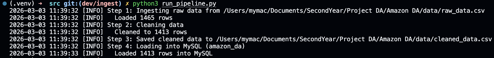
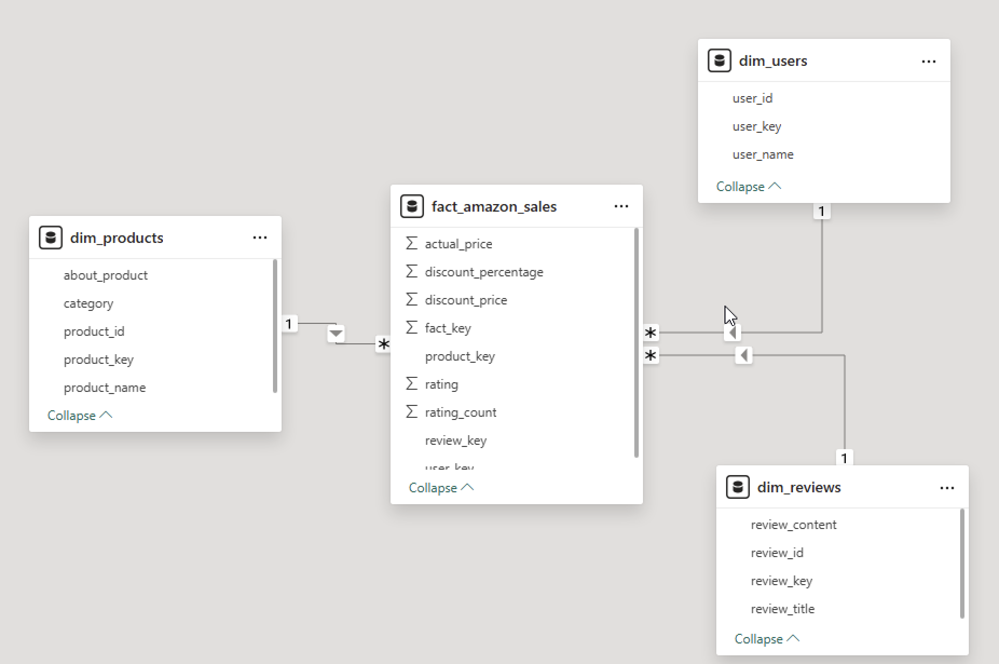
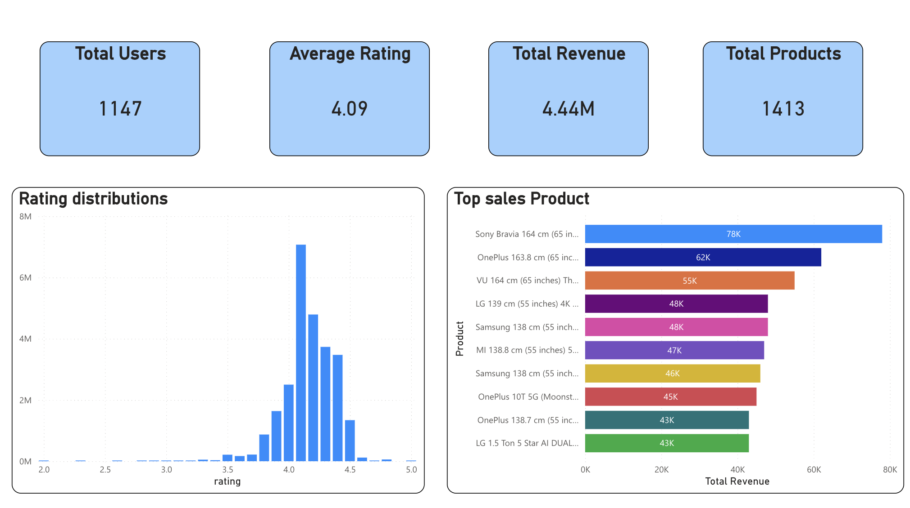
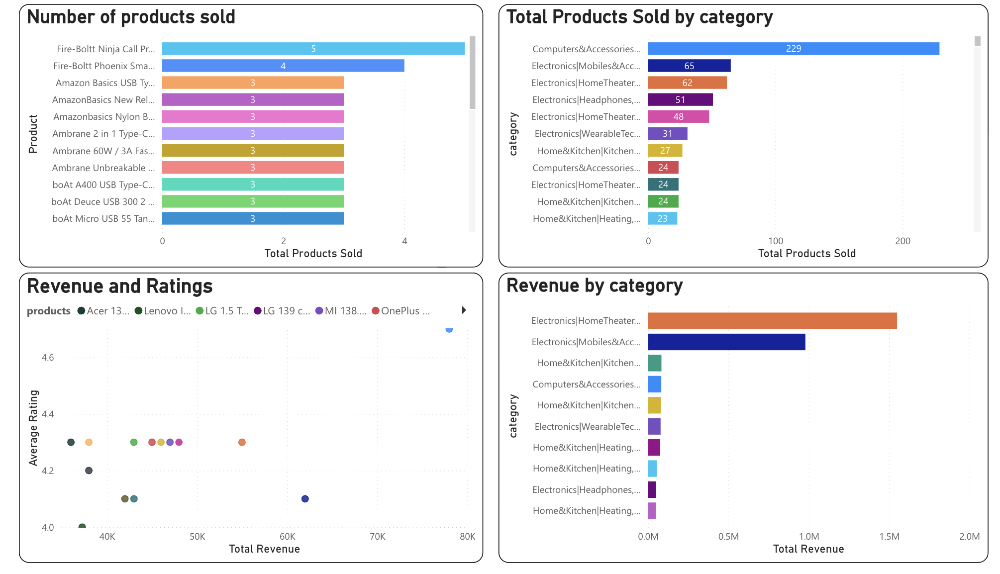
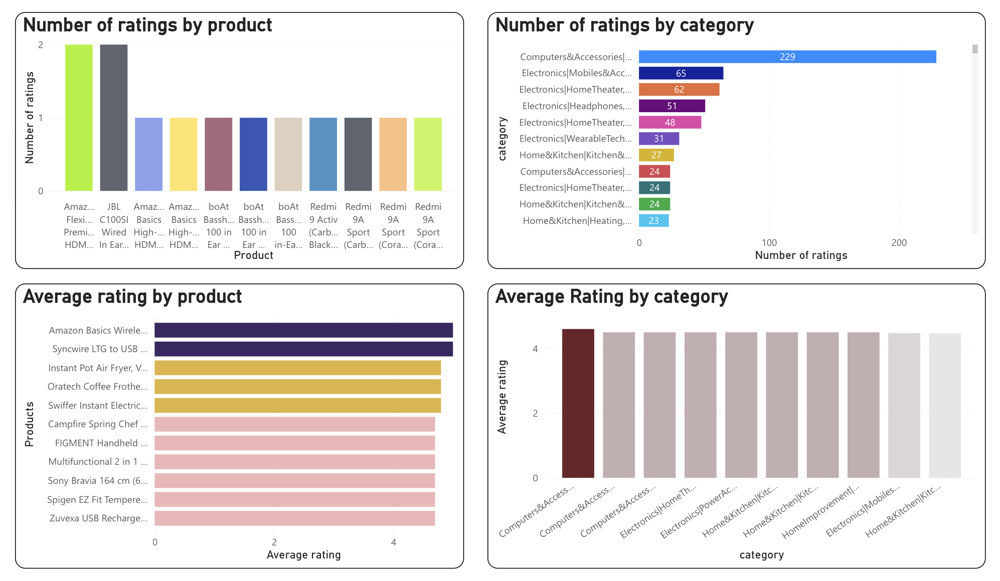

# Amazon DA

A **data pipeline** and **data warehouse** project for Amazon product and review data. It ingests raw CSV data, cleans it, loads it into MySQL, and provides a star-schema warehouse (dimension and fact tables) for analysis.

Dashboards for the project is here: https://app.powerbi.com/view?r=eyJrIjoiYjU3M2Q4N2QtY2FhMi00MmVjLTg2YTAtY2U2ZGJmODJlMDcyIiwidCI6Ijc4NGU5YWE4LWI4ZjQtNGFhOS1iMTgzLTE5ODExNjE5YjllZSJ9

---

## Overview

The project:

1. **Ingests** raw product/review data from `data/raw_data.csv`
2. **Cleans** the data (nulls, duplicates, type normalization, filters)
3. **Exports** cleaned data to `data/cleaned_data.csv`
4. **Loads** cleaned data into MySQL (staging table `amazon_products`)
5. **Warehouse** SQL scripts define a star schema (dimensions + fact table) and load logic
6. **Analytics** Using PowerBI for creating dashboard and gaining insights

Analysis and experimentation can be done in the `notebooks/experiments.ipynb` Jupyter notebook.

---

## Project structure

```
Amazon DA/
├── data/
│   ├── raw_data.csv      # Input: raw Amazon product/review data (you provide this)
│   └── cleaned_data.csv  # Output: cleaned data (generated by pipeline)
├── src/
│   ├── config.py         # Paths and MySQL config (reads from .env)
│   ├── run_pipeline.py   # CLI entry point
│   ├── ingestion/        # Load raw CSV
│   ├── cleaning/         # Data quality and type normalization
│   ├── database/         # MySQL connection and load
│   └── pipeline/         # Orchestrates: ingest → clean → CSV → MySQL
├── warehouse/
│   ├── staging.sql       # Use database (amazon_da)
│   ├── dim_tables.sql    # Dimension tables (products, users, reviews)
│   ├── dim_tables_load.sql   # Load dimensions from amazon_products
│   ├── fact_tables.sql   # Fact table (sales/reviews)
│   └── fact_tables_load.sql  # Load fact from amazon_products + dims
├── notebooks/
│   └── experiments.ipynb    # EDA and analysis
├── img/                     # Screenshots and diagrams
│   ├── pipeline_result.png  # Pipeline run output
│   └── star_schema.png      # Star schema diagram
├── requirements.txt
├── .env.example         # Template for environment variables
└── README.md
```

---

## Requirements

- **Python 3.12+** (or compatible 3.x)
- **MySQL** (for loading data and running warehouse scripts)
- Raw data file: `data/raw_data.csv` with columns matching the pipeline (see **Data schema** below)

---

## Setup

### 1. Clone and virtual environment

```bash
cd "Amazon DA"
python3 -m venv .venv
source .venv/bin/activate   # On Windows: .venv\Scripts\activate
```

### 2. Install dependencies

```bash
pip install -r requirements.txt
```

Main dependencies: `pandas`, `numpy`, `matplotlib`, `sqlalchemy`, `pymysql`, `python-dotenv`, `ipykernel` (for Jupyter).

### 3. Environment variables (for MySQL)

Copy the example env file and edit with your MySQL settings:

```bash
cp .env.example .env
```

In `.env`, set (adjust values as needed):

```env
MYSQL_HOST=localhost
MYSQL_PORT=3306
MYSQL_USER=root
MYSQL_PASSWORD=your_password
MYSQL_DATABASE=amazon_da
MYSQL_TABLE=amazon_products
```

If you skip MySQL (e.g. only want cleaned CSV), you can omit or leave these empty and use `--no-db` when running the pipeline.

### 4. Raw data

Place your raw Amazon product/review CSV at:

```
data/raw_data.csv
```

Expected columns include: `product_id`, `product_name`, `category`, `discounted_price`, `actual_price`, `discount_percentage`, `rating`, `rating_count`, `about_product`, `user_id`, `user_name`, `review_id`, `review_title`, `review_content`, and optionally `img_link`, `product_link`. The cleaning step handles formats like `₹` and `%` and comma-separated numbers.

---

## Usage

### Run the full pipeline

From the **project root**:

```bash
python src/run_pipeline.py
```



---

## Data cleaning (summary)

The cleaning step (aligned with `notebooks/experiments.ipynb`):

- Drops rows with missing `rating_count`
- Drops duplicate rows
- Converts `rating`, `rating_count`, `discounted_price`, `actual_price`, `discount_percentage` to numeric (strips `₹`, `,`, `%` as needed)
- Drops rows with missing `rating` after conversion
- Keeps only rows where `discount_percentage > 0`

---

## Data warehouse (MySQL)

After the pipeline has loaded `amazon_products`, you can build the star schema.

### 1. Create database (if needed)

```sql
CREATE DATABASE IF NOT EXISTS amazon_da;
USE amazon_da;
```

### 2. Run warehouse scripts in order

1. **Staging**  
   Run `warehouse/staging.sql` to `USE amazon_da;` (or ensure you’re in that database).

2. **Dimension tables**  
   Run `warehouse/dim_tables.sql` to create:
   - `dim_products` (product_id, product_name, category, about_product)
   - `dim_users` (user_id, user_name)
   - `dim_reviews` (review_id, review_title, review_content)

3. **Load dimensions**  
   Run `warehouse/dim_tables_load.sql` to populate dimensions from `amazon_products` (with `ON DUPLICATE KEY UPDATE`).

4. **Fact table**  
   Run `warehouse/fact_tables.sql` to create `fact_amazon_sales` (product_key, user_key, review_key, discounted_price, actual_price, discounted_percentage, rating, rating_count).

5. **Load fact**  
   Run `warehouse/fact_tables_load.sql` to populate the fact table by joining `amazon_products` to the dimension tables.




* **Note**: Column names in the load scripts must match your `amazon_products` and fact table definitions; adjust if your schema uses different names (e.g. `discount_percentage` vs `discounted_percentage`).

---

## Analytics process:

**Executive summary:**



We can see that the total revienue is 4.44 millions with 1413 products being sold for 1147 users. The average rating is pretty high at around 4.09/5.

The rating distributions is a little bit left-skewed with the median at around 4.3, there are also some outliers as with some customer giving a really low score(2) and some giving the maximum score(5).

The top sales products are Sony Bravia 164cm with the revenue about 78000, followed by OnePlus 163.8cm at aroung 62000.

**Product Performance:**



We can see that the Fire Boltt Ninja Call Pro Plus 1.83 Smart Watch is the best seller with 5 products been sold, while the Computer and Accessories for USB cables has the most products been sold in the Amazon app.

Most products that has the high revenue also has the high ratings, all nearly around 4.3/5 and the OnePlus, which has the most products sold, receive ta really high rating score from customer (4.7/5).

Even though the Computer and Accessories for USB cables account for the most products sold in the app, the Electronics for Home Theater actually gains the most revenue at aroung 1550000.

**Customer Behavior:**



We can see that most products only has 1 rating from the customer, with the highest is only 2 from both Amazon HDMI Cable and JBL Wired In Ear product.

The highest average rating for products belong to Amazon Basic Wireless Mouse and Syncire LTG to USB with both receive the score of 5/5. 

---

## Configuration

- **Paths**: Data paths are set in `src/config.py` (project root, `data/`, `raw_data.csv`, `cleaned_data.csv`). It loads `.env` from the project root.
- **MySQL**: All connection settings come from environment variables (see **Setup** above). Defaults are `localhost`, port `3306`, user `root`, database `amazon_da`, table `amazon_products`.

---

## Development

- **Notebooks**: Use `notebooks/experiments.ipynb` for exploration and visualizations (e.g. matplotlib). The cleaning logic in `src/cleaning/__init__.py` is kept in sync with the notebook.

---

## License

MIT License.
